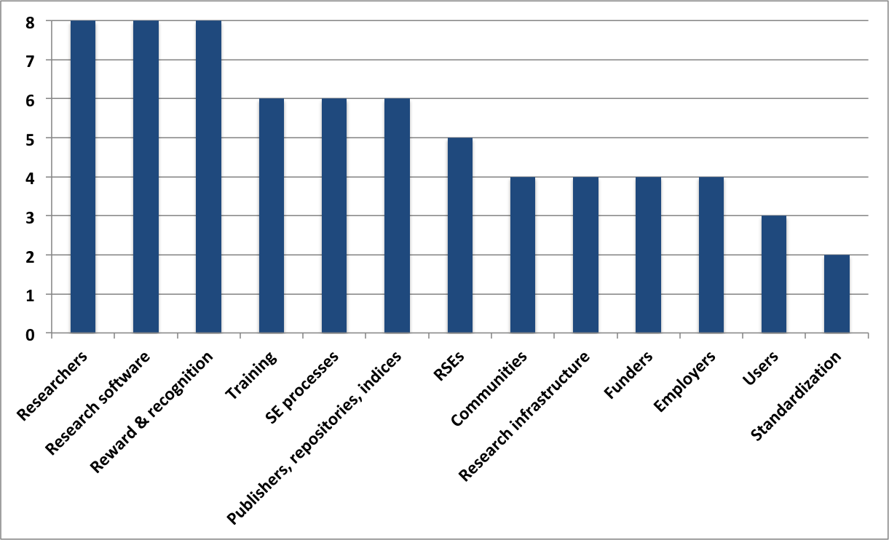

## Mapping the research software sustainability space

Stephan Druskat, ORCID [0000-0003-4925-7248](https://orcid.org/0000-0003-4925-7248)  
Daniel S. Katz, ORCID [0000-0001-5934-7525](https://orcid.org/0000-0001-5934-7525)

WSSSPE6.1 at IEEE eScience 2018, 29 Oct 2018, Amsterdam, NL

Slides: https://sdruskat.net/wssspe6-1-resosuma/

Note:
# - Going to talk about a model to record activities in the research software sustainability space
# - This model can be used to build a classification scheme for research output from the space
# - And to identify gaps and avoid duplication of efforts

## About us

- **Stephan:** RSE (linguistics), Humboldt-Universität zu Berlin; Software Sustainability Institute (SSI) Collaborator
- **Dan:** Assistant Director for Scientific Software and Applications, 
National Center for Supercomputing Applications (NCSA); Research Associate Professor (Computer Science, Electrical and Computer Engineering, School of Information Sciences), University of Illinois Urbana-Champaign; Better Scientific Software (BSSw) Fellow

Note:
# - A few words about us

### The research software sustainability space

Different actors, for example:

Note:
# - SSI founded in 2010 in the UK
# - WSSSPE organization and series of workshops
# - To a certain extent the international RSE community
# - And a number of new actors: URSSI + Better Scientific Software Community
# - A new initiative by leaders in the space (Michelle Barker XXXTODO, Dan Katz, Neil Chue Hong) to better coordinate international efforts ("Research Software Alliance")

### The research software sustainability space

- All actors conduct research and publish within the space
- Efforts are uncoordinated
- (Desirable) autonomy of activities bears risks: 
	- duplication of efforts
	- neglect of specific areas

Note:
# - All actors publish research in different venues: journals, blogs, etc.
# - Research feeds back into policy, education, and hiring practices in instutions
# - Also into educational activities (Carpentries)
# - Efforts are not coordinated, and perhaps shouldn't be (for reasons of productivity)
# - This autonomy bears the risk of duplication of efforts / neglect of specific areas

### Mapping research software sustainability activities

<i class="fa fa-lightbulb"></i> **Map activities in the research software 
sustainability space**

<i class="fa fa-lightbulb"></i> **Classify efforts (past, present, future) according to mapping**

- Application reduces risks (duplication of efforts, neglect of areas)
- Specifies involved parties and activities

Note:
# - Idea is to map activities in the research software sustainability space
# - And use this mapping to classify existing efforts and outputs
# - In order to identify gaps, and avoid duplication

### Research software sustainability mapping

- Existing classification schemes (e.g., ACM CCS) not suitable
- Must reflect configuration of agents and activities

Note:
# - There are existing classification schemes for software-related activities
# - For example: ACM XXXTODO XXXOTHERS?XXX
# - The problem with those is that they do not reflect the configuration of the research software sustainability space in terms of agents and activities
# - I'll come to the mapping proper

### Similar work by Jay & Haines

Jay & Haines for WSSSPE5.1 report ([arxiv.org/abs/1807.07387](https://arxiv.org/abs/1807.07387)), cf.:  
Jay C, Haines R. WSSSPE 5.1 - Data for speed blog analysis; 2018.
Available from: https://doi.org/10.5281/zenodo.1305091.

Note:
# - Caroline Jay and Rob Haines have classified activities as described in the WSSSPE 5.1 speed blogs with a mixed thematic/framework-analytic approach
# - Similar method: Took an existing schematic and refined it slightly, then coded blog articles

### Research software sustainability mapping v1

<table style="height: 100em;">
<tr>
<td width="50%"></td>
<td style="vertical-align: top; align: left;">
 
D. S. Katz, “Research Software Sustainability: WSSSPE &
URSSI,” Apr. 2018. [Online]. Available: 
https://doi.org/10.6084/m9.figshare.6081248.v1</td>
</tr>
</table>

Note:
# - This is the original schematic that both Caroline & Rob and I started from
# - Used by Dan in his talk at the SSI Collaborations Workshop in XXXTODO
# - Very general nodes representing agents, and edges that cluster activity verbs

### Research software sustainability mapping v2

#### Optimization of v1

- Comprehensiveness
- Increased resolution
- Disassembly of combined activities
- Filling gaps

Note:
# - I have started to optimized this schematic for to build it into a more comprehensive schematic
# - Increased resolution by splitting the concepts of some nodes
# - And disassembling combined activities
# - Finally filled some gaps

### Research software sustainability mapping v2

#### Concrete steps

1. Initial formalization (enables classification)
2. Refinement

Note:
# - What have I actually done?
# - Formalized the schematic in a first step
# - Formalization enables actual classification of outputs
# - Then refined the model

### Research software sustainability mapping v2

#### Formalization

1. Disassembly of activities (*action* verbs)
2. Representation as *resosuma* CSV:

| *Actor* | *Action* | *Actee* |
|---|---|---|
| *People* | *develop* | *Software* |
| *People* | *use* | *Software* |
| ... | ... | ... |

S. Druskat, “resosuma: 0.2.0,” Jun. 2018. [Online]. Available: https://doi.org/10.5281/zenodo.1304254

Note:
# - XXX HERE

### Research software sustainability mapping v2

Note:
# - This CSV can be transformed to a directed graph with a simple Python package

### Research software sustainability mapping v3

#### Refinement of v2

- Comprehensiveness
- Higher resolution
- Filling gaps

<i class="fa fa-exclamation-triangle"></i> Based on introspection,  
future work to include structured literature analysis

Note:
# - In a second step I havee then refined the model in the CSV
# - Word of warning: all based on introspection, should be quantified, e.g., by a structured literature analysis

### Research software sustainability mapping v3

#### Refinement of v2

- *People* > *Research Software Engineers*, *Researchers*, *Educators*
- *Publishers, repositories, indices* > different nodes, respective activities
- *Software* > *Research software*, *Supporting software*
- *are* introduced: *RSEs* + *Researchers* may be same person in different roles
- Further activities added: *own* (*RSEs*-*own*-*Research software*)

S. Druskat, D. S. Katz, and N. Chue Hong, “research-software/resosuma-data: 0.4.0,” Sep. 2018. [Online]. Available: https://doi.org/10.5281/zenodo.1419768

Note:
# - Split nodes, e.g., the "People" node.
# - Note different choice of roles than Jay & Haines

### Research software sustainability mapping v3

### Research software sustainability mapping v4?

#### a.k.a. Future work (by the community!)

- Find a usable visualization (web-based?)
- Complete the model
	- Iterative versions track state changes in the space
- Build a classification scheme
	- Handles? *resosuma:rse-dev-rso*?
- Classify efforts (tag publications)
- Diversify scheme granularity?
- Multipliers (editors/program committees) to ask for tags in keywords
- Create a central resource for resosuma (website?)

### You're invited to collaborate!

Review, discuss and contribute to the model:

<i class="fa fa-github"/></i> https://github.com/research-software/resosuma-data

# Thanks!

*Funding assistance (S. Druskat):* **Software Sustainability Institute** <i class="fa fa-heart"/></i>  
(EPSRC, BBSRC, ESRC Grant EP/N006410/1)

Slides: https://sdruskat.net/wssspe6-1-resosuma/

stephan.druskat@hu-berlin.de, <i class="fa fa-twitter"/></i> [@stdruskat](https://twitter.com/stdruskat),
<i class="fa fa-github"/></i> [@sdruskat](https://github.com/sdruskat)  
d.katz@ieee.org, <i class="fa fa-twitter"/></i> [@danielskatz](https://twitter.com/danielskatz),
<i class="fa fa-github"/></i> [@danielskatz](https://github.com/danielskatz/)
