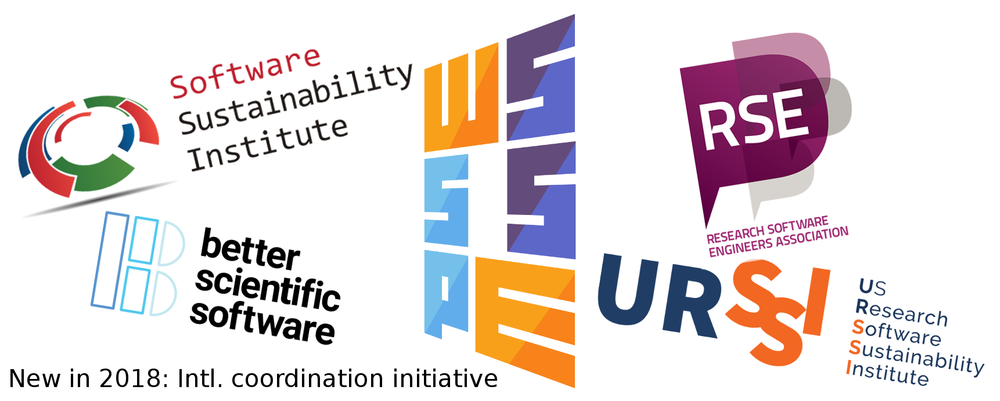
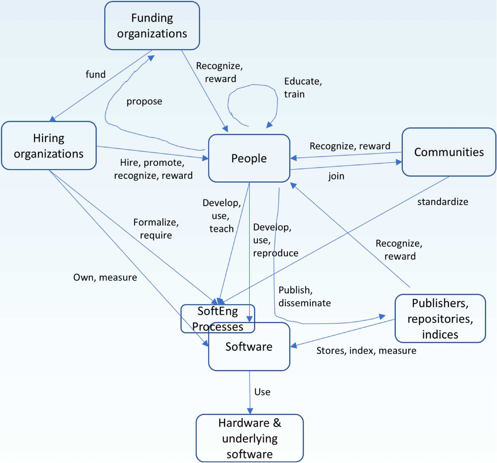
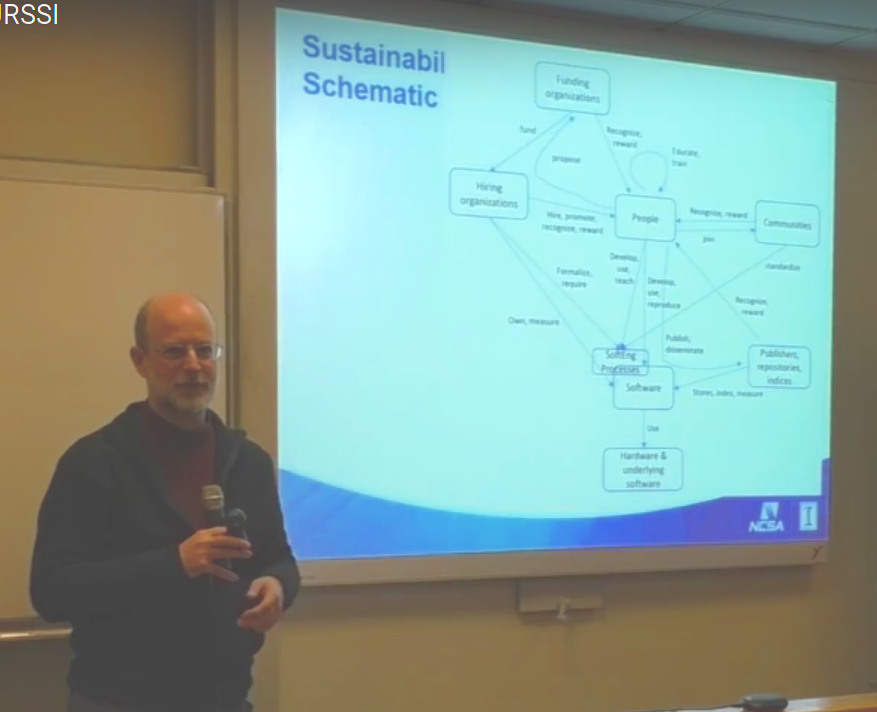
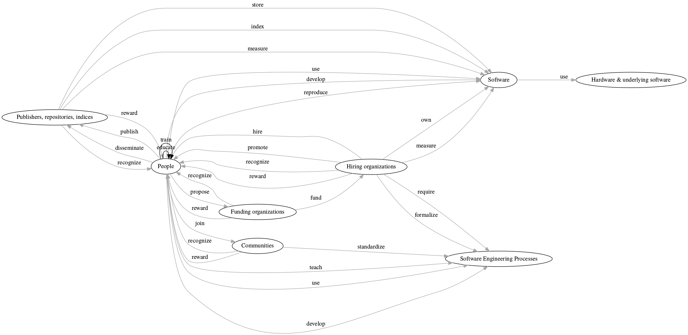
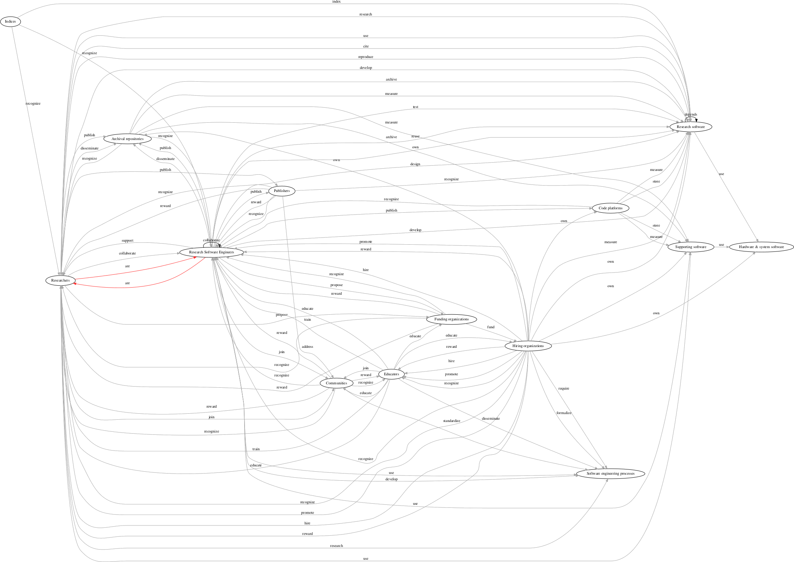

## Mapping the research software sustainability space

Stephan Druskat, ORCID [0000-0003-4925-7248](https://orcid.org/0000-0003-4925-7248)  
Daniel S. Katz, ORCID [0000-0001-5934-7525](https://orcid.org/0000-0001-5934-7525)

WSSSPE6.1 at IEEE eScience 2018, 29 Oct 2018, Amsterdam, NL

Slides: https://sdruskat.net/wssspe6-1-resosuma/

## About us

- **Stephan:** RSE (linguistics), Humboldt-Universität zu Berlin
- **Dan:** Assistant Director for Scientific Software and Applications, 
National Center for Supercomputing Applications (NCSA); Research Associate Professor (Computer Science, Electrical and Computer Engineering, School of Information Sciences), University of Illinois Urbana-Champaign; Better Scientific Software (BSSw) Fellow

### The research software sustainability space

Different actors, for example:

Note:
- Personen, die in der Wissenschaft arbeiten und Software entwickeln.
- wenden Methoden aus der Softwaretechnik auf Forschungssoftware an
- verbinden sie Wissen aus der Softwareentwicklung mit Domänenwissen
- sorgen so dafür, dass die entstehende Forschungssoftware nutzbar und nachnutzbar ist und nachvollziehbar korrekte Forschungsergebnisse liefert
- Bei dem Begriff geht es aber auch um die Sichtbarkeit des Tätigkeitsfeldes, Softwareentwicklung in der Wissenschaft

### The research software sustainability space

- Actors conduct research and publish within the space
- Efforts are uncoordinated
- (Desirable) autonomy of activities bears risks: 
	- duplication of efforts
	- neglect of specific areas

### Mapping research software sustainability activities

<i class="fa fa-lightbulb"></i> **Map activities in the research software 
sustainability space**

<i class="fa fa-lightbulb"></i> **Classify efforts (past, present, future) according to map**

- Specifies involved parties and activities
- Application reduces risks (duplication of efforts, neglect of areas)

### Research software sustainability mapping

- Existing classification schemes (e.g., ACM CCS) not suitable
- Must reflect configuration of agents and activities

### Research software sustainability mapping v1

<table style="height: 100em;">
<tr>
<td width="50%"></td>
<td style="vertical-align: top; align: left;">
 
D. S. Katz, “Research Software Sustainability: WSSSPE &
URSSI,” Apr. 2018. [Online]. Available: 
https://doi.org/10.6084/m9.figshare.6081248.v1</td>
</tr>
</table>

### Research software sustainability mapping v2

#### Optimization of v1 in v2

- Comprehensiveness
- Disassembly of combined activities
- Increased resolution
- Filling gaps

### Research software sustainability mapping v2

#### Concrete steps

1. Initial formalization (enables classification)
2. Refinement

### Research software sustainability mapping v2

#### Formalization

1. Disassembly of activities (*action* verbs)
2. Representation as *resosuma* CSV:

| *Actor* | *Action* | *Actee* |
|---|---|---|
| *People* | *develop* | *Software* |
| *People* | *use* | *Software* |
| ... | ... | ... |

S. Druskat, “resosuma: 0.2.0,” Jun. 2018. [Online]. Available: https://doi.org/10.5281/zenodo.1304254

### Research software sustainability mapping v2

### Research software sustainability mapping v3

#### Refinement of v2 in v3

- Comprehensiveness
- Higher resolution
- Filling gaps

<i class="fa fa-exclamation-triangle"></i> Based on introspection,  
future work to include structured literature analysis

### Research software sustainability mapping v3

#### Refinement of v2 in v3

- *People* > *Research Software Engineers*, *Researchers*, *Educators*
- *Publishers, repositories, indices* > different nodes, respective activities
- *Software* > *Reearch software*, *Supporting software*
- *are* introduced: *RSEs* + *Researchers* may be same person in different roles
- Further activities added: *own* (*RSEs*-*Research software*)

S. Druskat, D. S. Katz, and N. Chue Hong, “research-software/resosuma-data: 0.4.0,” Sep. 2018. [Online]. Available: https://doi.org/10.5281/zenodo.1419768

### Research software sustainability mapping v3

### Research software sustainability mapping v4?

#### a.k.a. Future work (by the community!)

- Find a usable visualization (web-based?)
- Complete the model
	- Iterative versions track state changes in the space
- Build a classification scheme
	- Handles? *resosuma:rse-dev-rso*?
- Classify efforts (tag publications)
- Diversify scheme granularity?
- Multipliers (program committees) to ask for tags in keywords
- Create a central resource for resosuma (website?)

# Thanks!

*Funding assistance (S. Druskat):* **Software Sustainability Institute** <i class="fa fa-heart"/></i>  
(EPSRC, BBSRC, ESRC Grant EP/N006410/1)

Slides: https://sdruskat.net/wssspe6-1-resosuma/

stephan.druskat@hu-berlin.de, <i class="fa fa-twitter"/></i> [@stdruskat](https://twitter.com/stdruskat),
<i class="fa fa-github"/></i> [@sdruskat](https://github.com/sdruskat)  
d.katz@ieee.org, <i class="fa fa-twitter"/></i> [@danielskatz](https://twitter.com/danielskatz),
<i class="fa fa-github"/></i> [@danielskatz](https://github.com/danielskatz/)